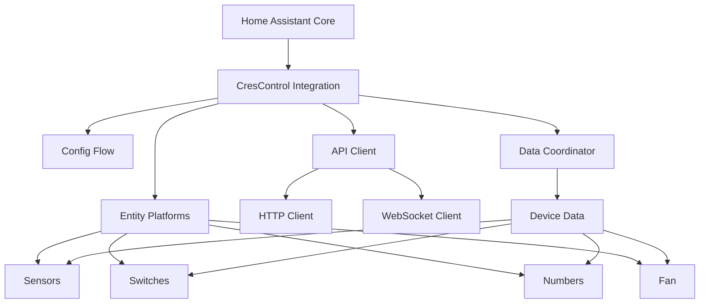

# Design Document

## Overview

The CresControl Home Assistant integration currently suffers from critical functionality and loading issues. Based on testing against the real device at 192.168.105.15:81, we've identified that:

1. HTTP API calls are failing with 400 Bad Request errors
2. WebSocket connectivity works on port 81 with `/websocket` path
3. The integration has overly complex error handling that may prevent loading
4. Many entities are defined but not appearing in Home Assistant

This design addresses these issues through a systematic approach focusing on core functionality first, then adding advanced features.

## Architecture

### Core Components



### Hybrid Architecture Approach

The current implementation is overly complex with extensive error handling and health monitoring that may be preventing basic functionality. However, WebSocket connectivity is confirmed working and provides real-time updates. The design will implement a phased approach:

**Phase 1: Core Functionality with WebSocket**
- Simplified HTTP API client for commands
- Working WebSocket client for real-time data
- Basic entity definitions
- Minimal error handling
- Standard Home Assistant patterns

**Phase 2: Enhanced Features**
- Advanced error handling and health monitoring
- PWM controls and calibration
- Diagnostic entities

## Components and Interfaces

### 1. API Client Redesign

**Current Issues:**
- Complex validation and error handling
- WebSocket integration causing conflicts
- HTTP endpoint format problems

**New Design:**
```python
class CresControlClient:
    """Hybrid API client with HTTP commands and WebSocket data."""
    
    def __init__(self, host: str, session: ClientSession):
        self._base_url = f"http://{host}:81"  # Fixed port based on testing
        self._session = session
        self._websocket_url = f"ws://{host}:81/websocket"  # Confirmed working
        self._websocket = None
        self._data_handlers = set()
    
    async def send_command(self, command: str) -> str:
        """Send command via HTTP (for writes/commands)."""
        # Simplified HTTP implementation for commands
        
    async def connect_websocket(self) -> None:
        """Connect to WebSocket for real-time data."""
        # WebSocket connection for live data updates
        
    async def subscribe_to_updates(self, parameters: List[str]) -> None:
        """Subscribe to parameter updates via WebSocket."""
        # Send subscription commands via WebSocket
```

**Key Changes:**
- Keep WebSocket functionality (confirmed working)
- Use HTTP for commands/writes, WebSocket for real-time data
- Use port 81 explicitly (confirmed working for both)
- Simplify request/response handling
- Maintain WebSocket integration for live updates

### 2. Entity Platform Simplification

**Current Issues:**
- Overly complex error handling in entities
- Too many entity definitions causing loading issues
- Advanced features preventing basic functionality

**New Design:**
```python
# Minimal entity definitions for initial implementation
CORE_SENSORS = [
    {"key": "in-a:voltage", "name": "Input A Voltage"},
    {"key": "in-b:voltage", "name": "Input B Voltage"},
    {"key": "fan:rpm", "name": "Fan RPM"},
]

CORE_SWITCHES = [
    {"key": "fan:enabled", "name": "Fan"},
    {"key": "switch-12v:enabled", "name": "12V Switch"},
]

CORE_NUMBERS = [
    {"key": "out-a:voltage", "name": "Output A Voltage"},
    {"key": "out-b:voltage", "name": "Output B Voltage"},
]
```

**Key Changes:**
- Start with minimal entity set
- Remove complex error handling and state preservation
- Use standard Home Assistant entity patterns
- Remove diagnostic and system entities initially

### 3. Data Coordinator Simplification

**Current Issues:**
- Complex health monitoring
- WebSocket integration causing conflicts
- Overly sophisticated retry logic

**New Design:**
```python
class CresControlCoordinator(DataUpdateCoordinator):
    """Hybrid coordinator using WebSocket for data, HTTP for commands."""
    
    def __init__(self, hass, client, host, update_interval):
        super().__init__(hass, _LOGGER, name="CresControl", update_method=self._async_update_data, update_interval=update_interval)
        self.client = client
        self._websocket_data = {}
        
    async def _async_update_data(self) -> Dict[str, Any]:
        """Use WebSocket data when available, HTTP as fallback."""
        # Try WebSocket data first (real-time)
        if self._websocket_data:
            return self._websocket_data
        
        # Fallback to HTTP polling
        commands = [
            "in-a:voltage", "in-b:voltage", 
            "fan:enabled", "switch-12v:enabled",
            "out-a:voltage", "out-b:voltage"
        ]
        return await self.client.send_commands(commands)
        
    def handle_websocket_data(self, data: Dict[str, Any]) -> None:
        """Handle incoming WebSocket data updates."""
        self._websocket_data.update(data)
        self.async_set_updated_data(self._websocket_data)
```

**Key Changes:**
- Keep WebSocket integration for real-time updates
- Use WebSocket data when available, HTTP as fallback
- Simplify command list to core parameters
- Remove complex health tracking initially
- Maintain real-time responsiveness

### 4. Configuration Flow Fixes

**Current Issues:**
- Complex validation preventing setup
- WebSocket testing causing failures
- Overly sophisticated retry logic

**New Design:**
```python
async def async_step_user(self, user_input=None):
    """Simplified configuration flow."""
    if user_input is not None:
        host = user_input["host"]
        # Simple connection test
        client = CresControlClient(host, session)
        await client.get_value("in-a:voltage")  # Basic connectivity test
        return self.async_create_entry(title=host, data={"host": host})
```

**Key Changes:**
- Remove complex validation and retry logic
- Remove WebSocket configuration initially
- Use simple connectivity test
- Standard config flow patterns

## Data Models

### Device Data Structure

```python
{
    # Analog inputs
    "in-a:voltage": "9.50",
    "in-b:voltage": "0.00",
    
    # Fan data
    "fan:enabled": "1",
    "fan:rpm": "0",
    
    # Switch states
    "switch-12v:enabled": "0",
    "switch-24v-a:enabled": "0",
    "switch-24v-b:enabled": "0",
    
    # Output voltages
    "out-a:voltage": "0.00",
    "out-b:voltage": "0.00",
    "out-c:voltage": "0.00",
    "out-d:voltage": "0.00",
    "out-e:voltage": "0.00",
    "out-f:voltage": "0.00",
    
    # Output enable states
    "out-a:enabled": "1",
    "out-b:enabled": "1",
    "out-c:enabled": "1",
    "out-d:enabled": "1",
    "out-e:enabled": "1",
    "out-f:enabled": "1",
}
```

### Entity Mapping

```python
ENTITY_MAPPINGS = {
    "sensor": [
        ("in-a:voltage", "Input A Voltage", "V"),
        ("in-b:voltage", "Input B Voltage", "V"),
        ("fan:rpm", "Fan RPM", "rpm"),
    ],
    "switch": [
        ("fan:enabled", "Fan"),
        ("switch-12v:enabled", "12V Switch"),
        ("switch-24v-a:enabled", "24V Switch A"),
        ("switch-24v-b:enabled", "24V Switch B"),
        ("out-a:enabled", "Output A Enabled"),
        ("out-b:enabled", "Output B Enabled"),
        ("out-c:enabled", "Output C Enabled"),
        ("out-d:enabled", "Output D Enabled"),
        ("out-e:enabled", "Output E Enabled"),
        ("out-f:enabled", "Output F Enabled"),
    ],
    "number": [
        ("out-a:voltage", "Output A Voltage", 0.0, 10.0, 0.01, "V"),
        ("out-b:voltage", "Output B Voltage", 0.0, 10.0, 0.01, "V"),
        ("out-c:voltage", "Output C Voltage", 0.0, 10.0, 0.01, "V"),
        ("out-d:voltage", "Output D Voltage", 0.0, 10.0, 0.01, "V"),
        ("out-e:voltage", "Output E Voltage", 0.0, 10.0, 0.01, "V"),
        ("out-f:voltage", "Output F Voltage", 0.0, 10.0, 0.01, "V"),
    ],
}
```

## Error Handling

### Simplified Error Strategy

**Current Issues:**
- Overly complex error handling preventing basic functionality
- Too many error types and recovery mechanisms
- Health monitoring adding complexity

**New Approach:**
1. **Basic Retry**: Simple 3-attempt retry with 1-second delays
2. **Standard Exceptions**: Use Home Assistant standard exception types
3. **Graceful Degradation**: Return None for unavailable values
4. **Logging**: Simple debug/error logging without complex diagnostics

```python
async def send_command(self, command: str) -> str:
    """Send command with basic retry logic."""
    for attempt in range(3):
        try:
            async with self._session.get(
                f"{self._base_url}/command",
                params={"query": command},
                timeout=10
            ) as response:
                response.raise_for_status()
                return await response.text()
        except Exception as err:
            if attempt == 2:  # Last attempt
                raise UpdateFailed(f"Failed to send command: {err}")
            await asyncio.sleep(1)
```

## Testing Strategy

### Phase 1: Basic Functionality Testing

1. **HTTP API Testing**
   - Test different endpoint formats (`/command`, `/api/command`, etc.)
   - Test different parameter formats
   - Validate response parsing

2. **Entity Loading Testing**
   - Verify integration loads without errors
   - Confirm entities appear in Home Assistant
   - Test basic read operations

3. **Configuration Testing**
   - Test config flow completion
   - Verify device discovery
   - Test connection validation

### Phase 2: Enhanced Feature Testing

1. **WebSocket Integration**
   - Test WebSocket connectivity on port 81
   - Implement real-time updates
   - Test fallback to HTTP polling

2. **Advanced Controls**
   - Test PWM functionality
   - Test fan speed control
   - Test calibration parameters

### Test Environment Setup

```python
# Test configuration for device at 192.168.105.15:81
TEST_CONFIG = {
    "host": "192.168.105.15",
    "port": 81,
    "websocket_path": "/websocket",  # Confirmed working
    "test_commands": [
        "in-a:voltage",  # Known to return "9.50"
        "out-a:voltage", # Known to return "0.00"
        "fan:rpm",       # May return error - needs investigation
    ]
}
```

## Implementation Phases

### Phase 1: Core Functionality with WebSocket (Priority 1)
- Simplified API client with working HTTP commands
- Working WebSocket client for real-time data updates
- Basic sensor, switch, and number entities
- Working configuration flow
- Standard Home Assistant integration patterns

### Phase 2: Enhanced Reliability (Priority 2)
- Improved error handling and retry logic
- State preservation during outages
- Better logging and diagnostics
- WebSocket reconnection and fallback logic

### Phase 3: Advanced Features (Priority 3)
- PWM controls and advanced parameters
- Health monitoring and diagnostics
- Environmental sensors and calibration
- Advanced WebSocket subscriptions

### Phase 4: Polish and Optimization (Priority 4)
- Advanced error recovery
- Connection pooling and optimization
- Comprehensive testing suite
- Documentation and examples

## Migration Strategy

### Backward Compatibility
- Maintain existing configuration format
- Preserve entity unique IDs
- Support existing automations and scripts

### Deployment Approach
1. **Simplified Implementation**: Replace complex code with basic functionality
2. **Incremental Testing**: Test each component individually
3. **Gradual Enhancement**: Add features back incrementally
4. **User Validation**: Confirm functionality with real devices

This design prioritizes getting the integration working reliably with basic functionality before adding advanced features. The current implementation appears to be suffering from over-engineering that prevents core functionality from working properly.